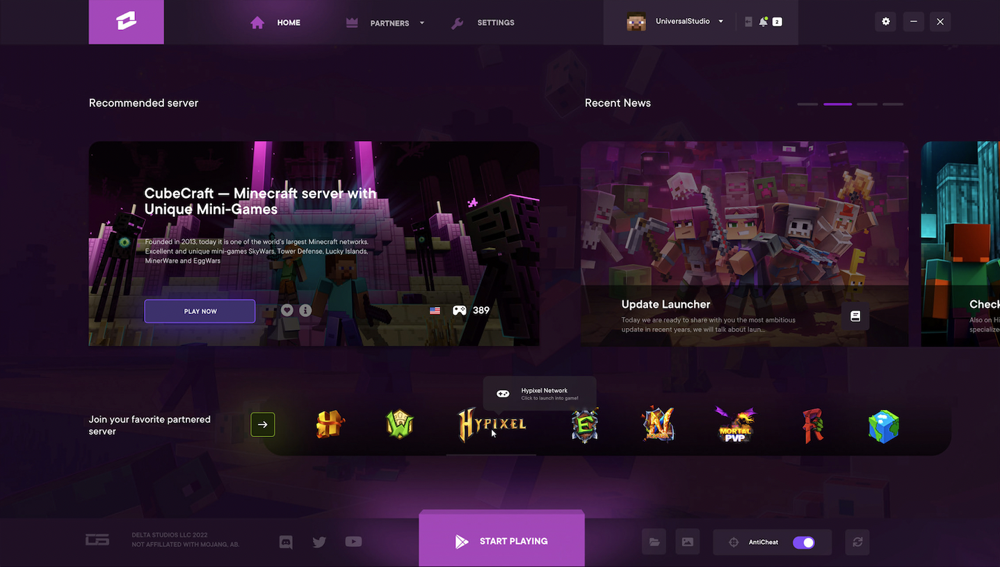

# Launcher

### Objetivos

Fases del proyecto a realizar:

- [x] Diseño inicial
- [ ] Funcionalidad básica
- [x] Sincronización y verificación de archivos
- [ ] Interacción con Microsoft y Mojang
- [ ] Revisado y puesta a punto
 

## 💻 Pre-Requisitos

Antes de ejecutar el programa asegúrate de lo siguiente:
* Dispones Java instalado en el ordenador
* Dispones de al menos `5GB` de espacio libre.
 

## 🚀 Instalación del Launcher

Para instalar el Launcher, sigue los siguientes pasos:

1. Descarga la versión que corresponda a tu sistema operativo entre las opciones `<Windows / MacOS / Linux>` de la parte inferior.
2. Ejecute el instalador y espere a completar todos los pasos.
3. Asegúrese de formar parte de los miembros del servidor.
4. Ejecute el juego desde el Launcher.
 

## ☕ Uso del Launcher

Con el Launcher podrás realizar las siguiente acciones:

* Ejecutar el juego abriéndose en la pantalla de menú principal.
* Ejecutar el juego abriéndose directamente dentro del servidor.
* Ver las novedades y avisos del servidor.
* Comprobar el estado del servidor y los jugadores en línea.
* Actualizar automáticamente nuevos Mods, ResourcePacks o Configuraciones.
* Reinstalar de manera sencilla el juego.
* Ajustar la cantidad de RAM asignada y parámetros variados del juego.
* Cambiar entre múltiples cuentas.
* Seleccionar skin y visualizar el historial de skins de tu jugador.
 

## 📎 Descargas

Escoge el archivo que corresponda a tu sistema operativo:

* [Windows](https://github.com/elRubenof/launcher)
* [MacOS](https://github.com/elRubenof/launcher)
* [Linux](https://github.com/elRubenof/launcher)
 

## 🤝 Colaboradores

Colaboradores del proyecto:

<table>
  <tr>
    <td align="center">
      <a href="#">
         
        
          <b>elRubenof</b>
        
      </a>
    </td>
  </tr>
</table>
 

## 📝 Licencia

Este proyecto existe bajo la licena General Public License (GPL). Cualquier uso comercial de este se prohíbe.
